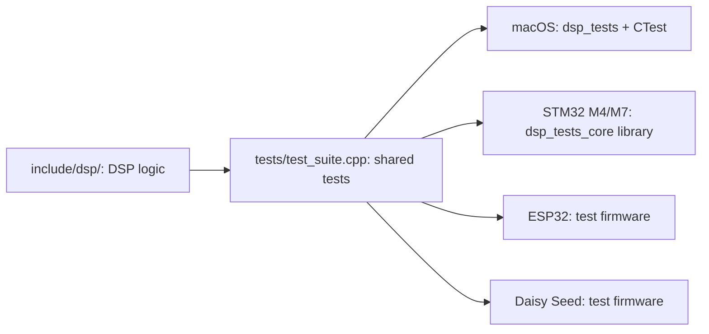
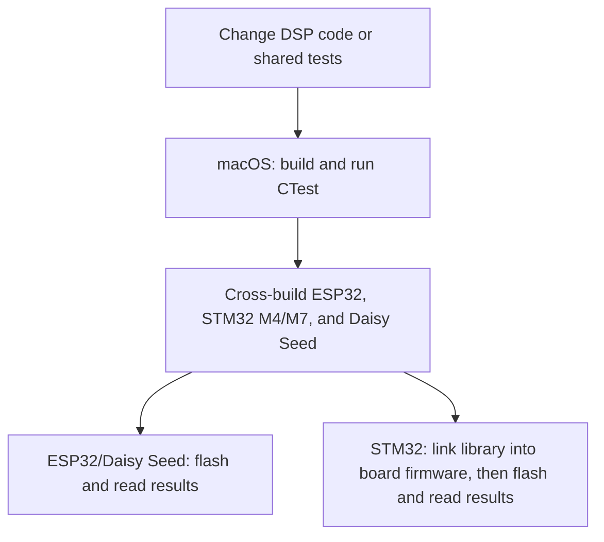

# Running the DSP tests

The tests in `tests/test_suite.cpp` exercise the same DSP code on every target. `dsp_run_tests` returns the number of failures and optionally reports each result through a C-compatible callback. The current suite tests a small sine oscillator; add new cases there as the roadmap progresses. Run board tests at startup, outside the audio callback or interrupt.

## Available targets

| Preset or build | Output | How tests run |
| --- | --- | --- |
| `macos` | `dsp_tests` executable (linked with `dsp_tests_core`) | `ctest --preset macos` or run the executable |
| `stm32-m4`, `stm32-m7` | `dsp_tests_core` static library | Link it into board firmware and call `dsp_run_tests` |
| `esp32` | `dsp_tests_esp32` firmware for the original ESP32 | Flash the board and read its serial output |
| Daisy Seed Makefile | `dsp_tests_daisy_seed` firmware | Program the Seed and read its USB serial log |

Only `macos` has a CTest preset. The STM32 presets compile a library, not board firmware, and Daisy Seed is built separately with libDaisy.

The DSP implementation in `include/dsp/` and the test cases in `tests/test_suite.cpp` are shared source code. Each toolchain compiles that source for its own processor; the targets do not share one binary.



Run the shared tests on hardware as well as on macOS when changing behavior that depends on timing, floating-point behavior, compiler settings, memory limits, or board I/O. The current checks have different levels of coverage:



macOS CTest verifies the algorithm on the host. Cross-builds verify that it compiles for each configured architecture. On-board runs verify that the compiled test suite actually passes on the device. There is currently no automatic on-board test runner or CTest preset for embedded targets.

## VS Code CMake Tools

Open the repository root in VS Code and use **CMake: Select Configure Preset** for `macos`, `stm32-m4`, `stm32-m7`, or `esp32`. For macOS, choose `dsp_tests` in **Build Target**; for either STM32 preset, choose `dsp_tests_core`. The ESP32 preset builds the ESP-IDF application; its generated `app`, `flash`, and `monitor` targets may also appear. Daisy Seed has no CMake preset. The workspace selects `/usr/local/bin/cmake` because the STM32 extension otherwise selects `cube-cmake`. The ESP32 preset names ESP-IDF 5.5.1 and toolchain paths installed on this Mac; update its `environment` block if those tools move.

## macOS

With CMake, a C++ compiler, and Ninja installed, run from the repository root:

```sh
cmake --preset macos
cmake --build --preset macos
ctest --preset macos
```

You can also run `build/macos/dsp_tests` to see individual test names. A failed test gives the executable a nonzero exit code.

## ESP32 (ESP-IDF)

With the [ESP-IDF](https://docs.espressif.com/projects/esp-idf/en/latest/esp32/get-started/) installation at the paths in the ESP32 preset, build from the repository root. Activate ESP-IDF in the shell before using `idf.py` to flash and monitor:

```sh
cmake --preset esp32
cmake --build --preset esp32
source ~/esp/v5.5.1/esp-idf/export.sh
idf.py -B build/esp32-unified -p /dev/cu.YOUR_PORT flash monitor
```

The preset targets the original ESP32, including ESP32-WROOM-32D modules; a USB-C connector on a board does not change the chip target. For another ESP-IDF chip, make a separate preset with its `IDF_TARGET` and build directory. Replace the serial port before flashing. On a typical original ESP32 board, USB-C connects through a USB-to-UART bridge for flashing and logs; hardware JTAG debugging requires an adapter connected to the board's JTAG pins. Check the board schematic to confirm its USB wiring ([Espressif JTAG guide](https://docs.espressif.com/projects/esp-idf/en/latest/esp32/api-guides/jtag-debugging/)). The firmware prints each result and aborts if any test fails. The ESP-IDF build uses the component under `platform/esp32/main` and builds the shared test source directly ([ESP-IDF build-system guide](https://docs.espressif.com/projects/esp-idf/en/latest/esp32/api-guides/build-system.html)).

## Daisy Seed (libDaisy)

Build [libDaisy](https://github.com/electro-smith/libDaisy) with its own instructions first. From `platform/daisy_seed`, point `LIBDAISY_DIR` at that checkout:

```sh
make LIBDAISY_DIR=/absolute/path/to/libDaisy
make LIBDAISY_DIR=/absolute/path/to/libDaisy program-dfu
```

The second command requires a connected Seed in DFU mode. Connect a USB serial monitor to read the results: `StartLog(true)` waits for the host before the suite runs. The Seed LED stays on when a test fails. This project follows the [libDaisy Makefile](https://github.com/electro-smith/libDaisy/blob/master/core/Makefile) and [serial logging](https://github.com/electro-smith/libDaisy/blob/master/doc/md/_a2_Getting-Started-Serial-Printing.md) conventions.

## Other STM32 boards

With Arm GNU Toolchain and Ninja installed, configure and build the portable test library from the repository root:

```sh
cmake --preset stm32-m4
cmake --build --preset stm32-m4
```

Use `stm32-m7` instead for a Cortex-M7 target. The output is `build/stm32-m4/libdsp_tests_core.a` or `build/stm32-m7/libdsp_tests_core.a`. These presets compile the shared suite for ARM; they do not produce a flashable image because the STM32 board, startup code, linker script, and hardware output are board-specific. The presets use the soft-float ABI, so select matching CPU/FPU/ABI flags for your firmware before linking the library, or compile `tests/test_suite.cpp` directly in the board project.

In a CubeIDE or other STM32 firmware project, add `include/` to the compiler include paths and link with the C++ runtime and math library. Call the C-compatible test entry point from the board's `main.c` after hardware and logging are initialized:

```c
#include "dsp/test_runner.h"
#include <stdio.h>

static void report_test(const char *name, int passed, void *context) {
    (void)context;
    printf("%s %s\r\n", passed ? "PASS" : "FAIL", name);
}

/* After HAL initialization, before the normal application loop: */
int failures = dsp_run_tests(report_test, NULL);
printf("DSP tests: %d failure(s)\r\n", failures);
```

Route `printf` to your board's UART or debugger console, then build, flash, and observe the output using that board's toolchain. For a persistent failure indication, use the result to set an LED or halt in the debugger. [ST's CMake/CubeIDE guide](https://www.st.com/resource/en/application_note/an5952-how-to-use-cmake-in-stm32cubeide-stmicroelectronics.pdf) covers one project setup option. The exact flash command depends on the STM32 board and programmer.

## Test design

Keep DSP algorithms independent of board headers. Add deterministic tests using impulses, known sample sequences, or measured tolerances. Keep board-specific audio, serial, and hardware setup in platform projects; only the reporter callback should differ across targets. The test runner avoids exceptions, dynamic allocation, and a third-party test framework so it can run in small firmware projects.
